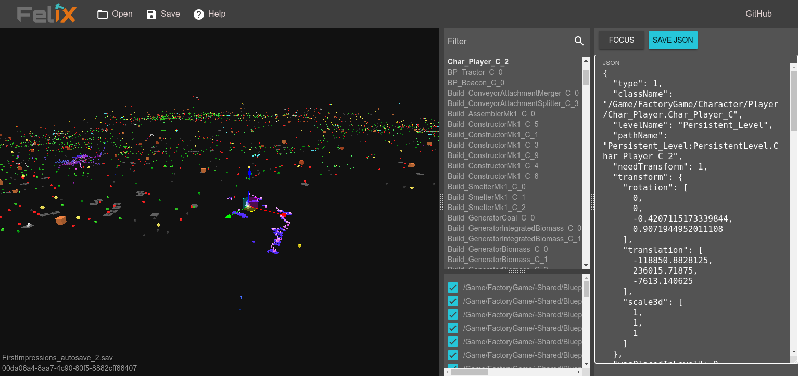

# FICSIT - FeliX



FeliX is a webapp to inspect save files of the game Satisfactory. [You can try it out online.](https://ficsit-felix.firebaseapp.com/)

It uses JavaScript, Vue, three.js and some other libraries for the frontend and TypeScript for Firebase functions on the backend. It is currently in the prototype stage. Any contributions are greatly appreciated!

You can find python scripts to transform save files to json and back at https://github.com/bitowl/satisfactory-save-format.

## Development
To run the application with hot reloading simply execute:
```
cd app
yarn install
yarn serve
```
